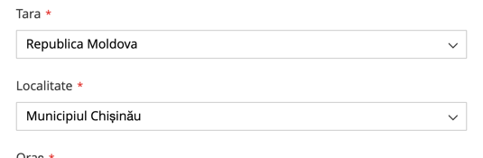

## Moldova Regions

This module adds the regions for Republic of Moldova country to the Magento 2 instance.

### Installation
1. Install via composer

```bash
composer require burlacuweb/magento2-module-moldova-regions
```

2. Run the following commands:

```bash
bin/magento module:enable BurlacuWeb_MoldovaRegions
bin/magento setup:upgrade
bin/magento setup:di:compile
```

### Description

The module adds the regions of Moldova country to the Magento 2 platform.

As a store administrator you can use the regions in the admin panel of your store
for places where regions are required (e.g. when you create/edit addresses or when you create a new order).

The store customers can select regions of Moldova when they create/edit addresses or place an order
instead of typing the region name manually.

This prevents typos and ensures that the region name is correct.



###  Links

https://www.iso.org/obp/ui/#iso:code:3166:MD

### Authors

[burlacu-web.com](https://burlacu-web.com)

Say [hi@burlacu-web.com](mailto:hi@burlacu-web.com)
